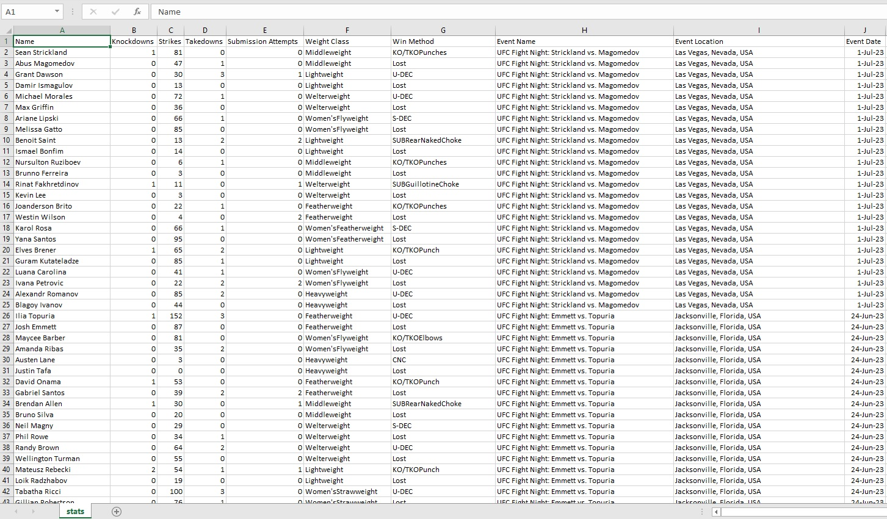
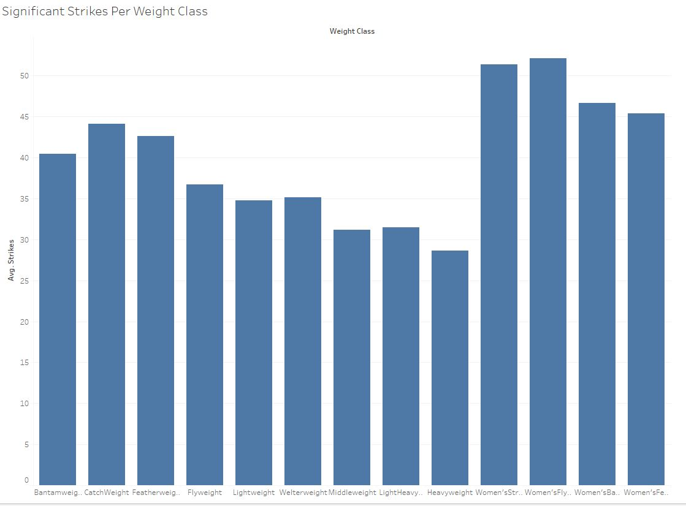
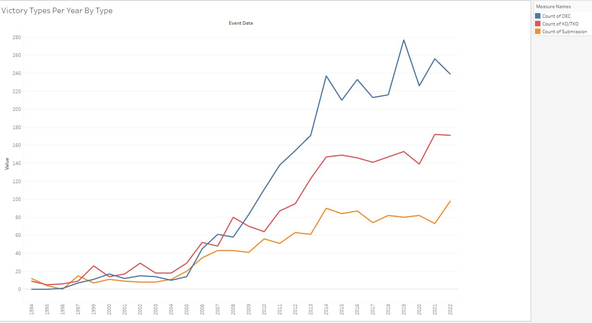
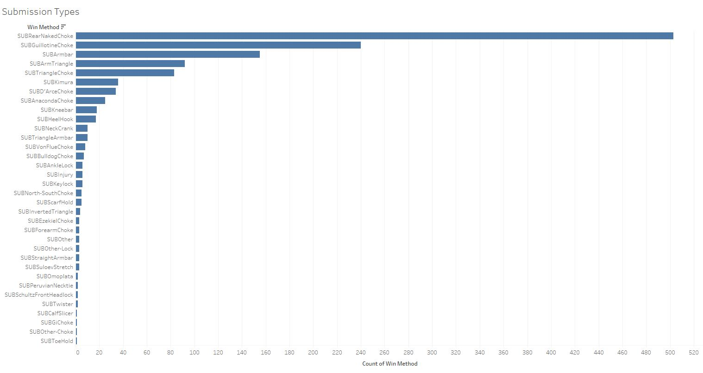

# UFCStatsLookup

## Description
Java built Web Scraper for http://ufcstats.com/statistics/events/completed?page=all events with the help of HTMLUnit and Gradle. The current stats.csv is accurate as of 7/7/23.  stats.csv can be used for data analytics or visualization with tools such as Tableau or Power BI.

## Why?
UFCStats does not provide an official API and data sets on Kaggle are not kept up to date and contain missing stats for certain cards (the data of the ones I found are around 5 years old).

## Stats kept
- Name
- Knockdowns
- Strikes
- Submission Attempts
- Weight Class
- Win Method
- Event Card Name
- Event Location
- Event Date
(Hopefully more in the future)

## Pictures

